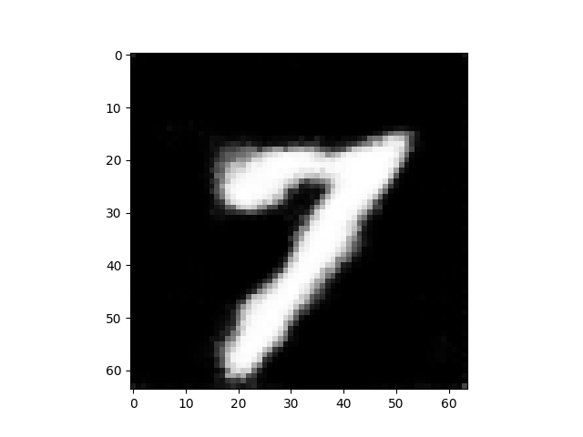
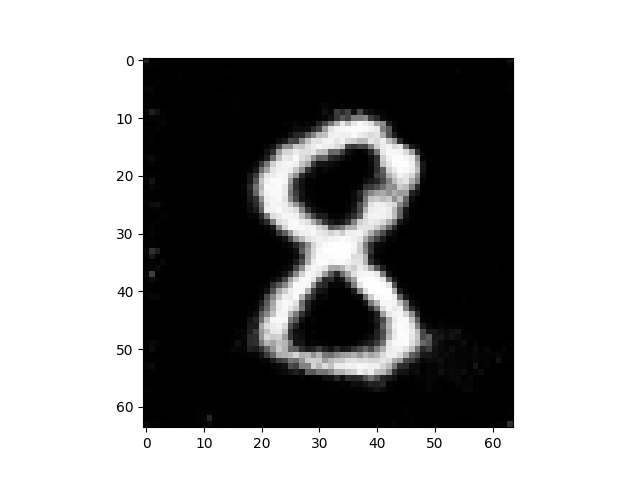

# DCGAN
PyTorch Lightningを利用したMNIST画像生成DCGANの実装です。

## 実行手順
1. `notebooks/make_folders_and_data_downloads.ipynb`の各セルを実行してMNISTデータを`data/`にダウンロードする。  
2. ニューラルネットワークを学習させる。  
   実行コマンドは以下のとおりです。`config/config.yml`で各種パラメータを変更することができます。
    ```
    env PYTHONPATH=$(pwd) poetry run python src/model/image_generate.py --config_path=config/config.yml
    ```
3. mlflow uiで、学習曲線や生成画像を確認する。   
   下記コマンドでサーバーを立ち上げられます。
   ```
   poetry run mlflow ui --backend-store-uri ./logs/mlruns/
   ```

## 生成画像
下記のような画像が生成されます。学習epoch数は100です。
|  88th epoch  |  99th epoch  |
| :----: | :----: |
|||

## 参考
- GitHub: [YutaroOgawa/pytorch_advanced](https://github.com/YutaroOgawa/pytorch_advanced/tree/master/5_gan_generation)
- GitHub: [PyTorchLightning/pytorch-lightning](https://github.com/PyTorchLightning/pytorch-lightning/blob/master/pl_examples/domain_templates/generative_adversarial_net.py)