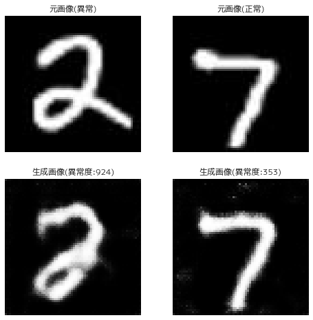

# GANによる異常検知
- GANによる異常検知アルゴリズムの実装です。データとしてMNISTを用います。
- 正常データを7,8として、異常データを2とします。

## 異常度算出フロー
1.  正常データを生成するGANモデルを構築する。
2.  テストデータと似たデータを生成できる潜在変数zを求める。
3.  その潜在変数zから生成されたデータと元のテストデータの誤差を求める。

## 実行手順
1. `notebooks/make_folders_and_data_downloads.ipynb`の各セルを実行してMNISTデータを`data/`にダウンロードする。  
2. ニューラルネットワークを学習させる。  
   実行コマンドは以下のとおりです。`config/config.yml`で各種パラメータを変更することができます。
    ```
    env PYTHONPATH=$(pwd) poetry run python src/model/image_generate.py --config_path=config/config.yml
    ```
3. mlflow uiで、学習曲線や生成画像を確認する。   
   下記コマンドでサーバーを立ち上げられます。
   ```
   poetry run mlflow ui --backend-store-uri ./logs/mlruns/
   ```
4. `notebooks/dcgan_anomaly_score.ipynb`の各セルを実行してテストデータの異常度を算出する。

## 結果
テスト画像の異常度算出結果は下記のようになります。異常データである2は元画像と乖離した画像しか生成できないため、異常度が大きくなります。
||
| :----: | 
||

## 参考
- GitHub: [YutaroOgawa/pytorch_advanced](https://github.com/YutaroOgawa/pytorch_advanced/tree/master/6_gan_anomaly_detection)