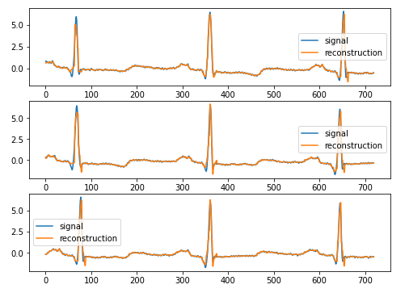

# PyTorch Lightningを利用したAutoEncoder
PyTorch Lightningを利用したAutoEncoderの実装です。
データには信号データであるMITの心電図波形データセットを用います。


## 実行手順
1. 心電図データをダウンロードする。  
    実行コマンドは以下のとおりです。
    ```
    poetry run python src/generate_dataset.py
    ```
2. ニューラルネットワークを学習させる。  
    実行コマンドは以下のとおりです。
    ```
    poetry run python src/torch_classifier_models.py
    ```

## 可視化
TensorBoardを起動させることで、学習曲線やネットワーク構造を可視化できます。
実行コマンドは以下のとおりです。
```
poetry run tensorboard --logdir=path/to/log
```

## 結果
再構成結果です。



## 参考
- [メディカルAI専門コースオンライン講義資料](https://japan-medical-ai.github.io/medical-ai-course-materials/notebooks/08_Sequential_Data_Analysis_with_Deep_Learning.html)
- [Keras Conv1Dで心電図の不整脈を検出する](http://cedro3.com/ai/ecg-anomaly/)